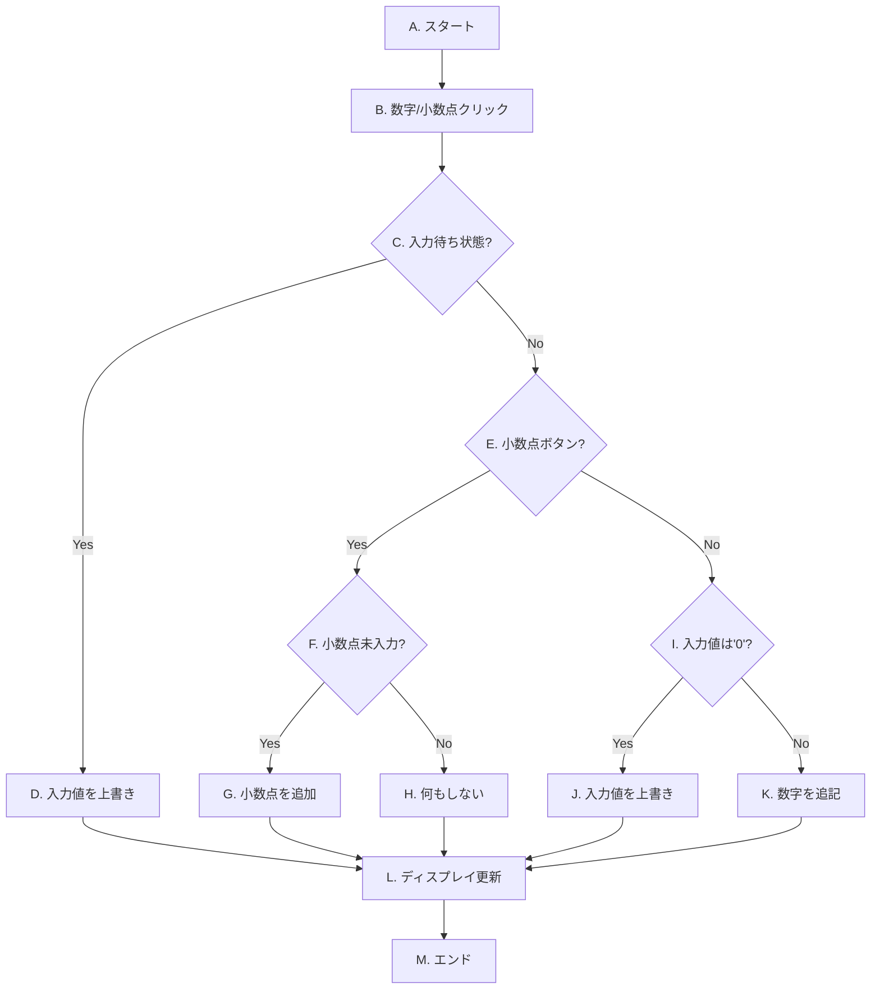
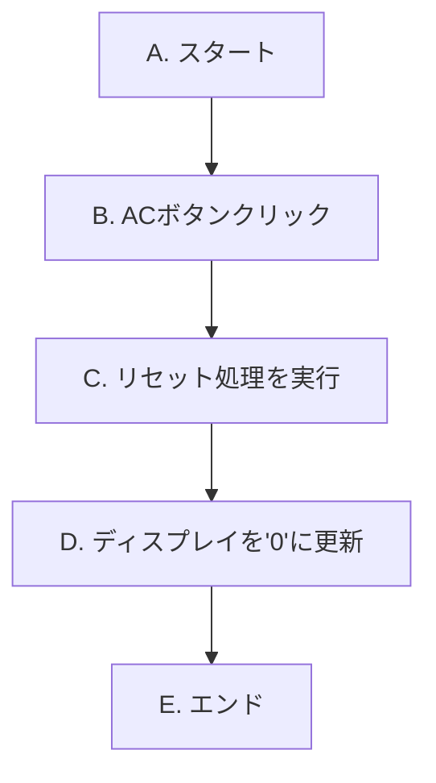
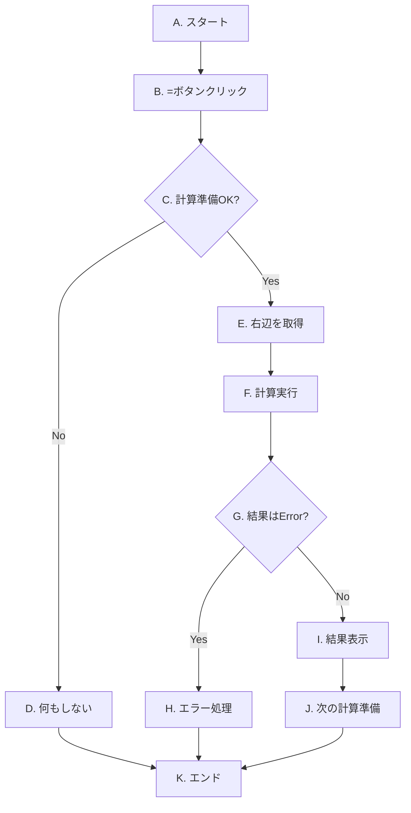
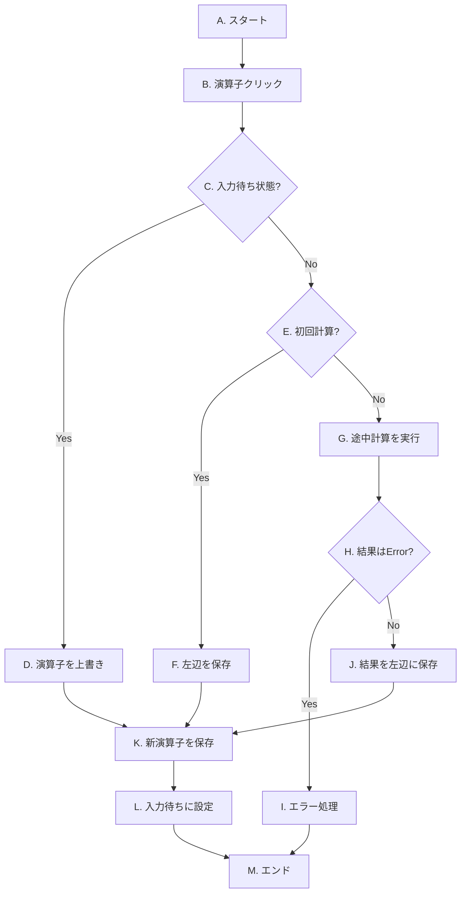

# OIC2025-Front03
動きを試す。
https://jun1waka.github.io/OIC2025-Front03/


電卓を作る
* 電卓のボタンを押すと表示窓に数値が表示される
* 四則演算を実行
* 「＝」ボタンで計算結果表示
* クリア・ACの動きを作る
# 電卓アプリケーション開発 課題仕様書・手順書
この資料は、専門学校の学生がJavaScriptを用いて電卓アプリケーションを作成するための仕様書および手順書です。各ステップは「課題」「考え方のヒント」「解法」の順で構成されています。まずは課題を読んで自分なりの答えを考え、ヒントを参考にしながら実装に挑戦し、最後に解法で答え合わせをする、という流れで学習を進めてください。

## Step 1: 画面の表示 (HTML/CSS)
最初の目標は、電卓の見た目をHTMLとCSSで作成することです。

### 1.1. 課題
以下の仕様を満たす電卓のレイアウトを作成しなさい。
* **全体**: 電卓のすべての部品を囲む、一つの大きな箱(div)を用意する。
* **ディスプレイ**: 数字や計算結果が表示される画面部分を作成する。
* **ボタン**:0〜9の数字、小数点(.)、四則演算(+, -, *, /)、オールクリア(AC)、イコール(=)の各ボタンを配置する。CSSで見やすく、4列に並ぶようにレイアウトする。
* **準備**: 後のステップで実装する「ドラッグ移動機能」のために、電卓全体が画面上の好きな位置に配置できるよう、CSSで準備をしておく。

### 1.2. 考え方のヒント
**HTMLの構成について**
* 部品をまとめるには、どのようなHTMLタグが適しているだろうか？ `<div>` タグがよく使われます。ディスプレイやボタン群など、意味のあるまとまりごとに `<div>` で囲むと、後の作業がしやすくなります。
* 各部品（ディスプレイ、数字ボタン、演算子ボタンなど）を後からCSSやJavaScriptで区別できるようにするには、どうすればよいだろうか？ `class` 属性を使って名前をつけるのが一般的です。

**CSSでのデザインについて**
* ボタンをきれいに4列に並べるには、どのようなCSSのテクニックがあるだろうか？ `display: flex;` と `flex-wrap: wrap;` の組み合わせが便利です。
* 各ボタンの横幅を均等にするには？ `width: 25%;` のように割合で指定する方法が考えられます。
* 要素を画面上の特定の位置に固定したり、後で座標を動かしたりするには、どの `position` プロパティを使えばよいだろうか？
* 影(`box-shadow`)や角の丸み(`border-radius`)を加えると、より見栄えが良くなります。

### 1.3. 解法（コード例）
ヒントを元に考えたコードと、以下の例を比べてみましょう。全く同じでなくても、仕様を満たせていれば問題ありません。

**HTML (index.html)**
```html
<!DOCTYPE html>
<html>
<head>
    <meta charset="UTF-8">
    <link rel="stylesheet" href="css/style.css">
    <title>電卓のサンプル</title>
</head>
<body>
    <div class="calc_app">
        <div class="display"></div>
        <div class="box">
            <div class="reset">AC</div>
            <div class="switch_dummy"></div>
            <div class="switch_dummy"></div>
            <div class="calculation">/</div>
            <div class="switch">7</div>
            <div class="switch">8</div>
            <div class="switch">9</div>
            <div class="calculation">*</div>
            <div class="switch">4</div>
            <div class="switch">5</div>
            <div class="switch">6</div>
            <div class="calculation">-</div>
            <div class="switch">1</div>
            <div class="switch">2</div>
            <div class="switch">3</div>
            <div class="calculation">+</div>
            <div class="switch">0</div>
            <div class="switch">.</div>
            <div class="switch_dummy"></div>
            <div class="result">=</div>
        </div>
    </div>
    <script src="js/app.js"></script>
</body>
</html>
```

**CSS (style.css)**
```css
.calc_app {
	border: 1px solid #ccc;
	padding: 10px;
	position: fixed; /* 画面上の位置に固定。後の移動機能で座標を動かす */
	text-align: center;
    background-color: #f0f0f0;
    border-radius: 8px;
    box-shadow: 0 4px 8px rgba(0,0,0,0.1);
}

.display {
	border: 1px solid #333;
	width: 200px;
	height: 50px;
	margin-bottom: 10px;
	line-height: 50px;
	text-align: right;
	overflow: hidden;
    padding: 0 10px;
    background-color: #e0e0e0;
    border-radius: 5px;
}

.box {
	width: 200px;
	display: flex;
	flex-wrap: wrap;
}

.switch, .switch_dummy, .reset, .result, .calculation {
	height: 50px;
	line-height: 50px;
	text-align: center;
	border: 1px solid #ccc;
	box-sizing: border-box;
	cursor: pointer;
    margin: 1px;
    width: calc(25% - 2px); /* 4列均等配置 */
}
```

## Step 2: イベントの設定 (JavaScript)
見た目ができたら、次はボタンが押されたことをJavaScriptで検知できるようにします。

### 2.1. 課題
HTMLで作成した各ボタンに、クリックイベントを設定しなさい。この段階では、ボタンがクリックされたら、そのボタンの文字がブラウザのコンソールに表示されるように実装すること。

### 2.2. 考え方のヒント
* HTMLの要素をJavaScriptで操作するには、まず何をする必要があるだろうか？ → `document.querySelector()` や `document.querySelectorAll()` を使って、対象の要素を取得（検索）する必要があります。
* 数字ボタンのように、同じ種類のボタンが複数ある場合はどうやって取得すればよいか？ → `querySelectorAll()` を使うと、条件に合う要素をすべてリストのように取得できます。
* 取得した要素に対して、「クリックされたら」という監視をさせるにはどうすればよいか？ → `addEventListener('click', function() { ... })` という構文を使います。
* 取得したボタンのリスト（配列のようなもの）の、一つ一つのボタンに同じイベントを設定するには？ → `forEach` という繰り返し処理が便利です。
* ちゃんと動作しているか確認するには？ → `console.log()` を使って、開発者ツールのコンソールにメッセージを出力します。

### 2.3. 解法（コード例）
`app.js` に以下のコードを記述します。
```javascript
// --- 1. HTML要素の取得 ---
// まずは操作したいHTML要素をすべて取得して、変数に入れておく
const display = document.querySelector('.display');
const switches = document.querySelectorAll('.switch');
const calculations = document.querySelectorAll('.calculation');
const resets = document.querySelectorAll('.reset');
const results = document.querySelectorAll('.result');

// --- 2. イベントリスナーの設定 ---
// forEachを使って、取得したボタンのリストそれぞれにクリックイベントを設定していく

// 数字ボタンの処理
switches.forEach(function (button) {
    button.addEventListener('click', function (e) {
        console.log('数字ボタン:', e.target.textContent);
    });
});

// 演算子ボタンの処理
calculations.forEach(function (button) {
    button.addEventListener('click', function (e) {
        console.log('演算子ボタン:', e.target.textContent);
    });
});

// ACボタンの処理
resets.forEach(function (button) {
    button.addEventListener('click', function () {
        console.log('ACボタンが押されました');
    });
});

// =ボタンの処理
results.forEach(function (button) {
    button.addEventListener('click', function () {
        console.log('=ボタンが押されました');
    });
});
```

## Step 3: 計算機能の実装 (JavaScript)
いよいよ電卓の心臓部である、計算ロジックを実装します。ここが一番の山場です。一つずつ着実に進めましょう。

### 3.1. 課題（全体）
Step 2で設定したイベントリスナーの中身を、実際の計算処理に書き換えなさい。
* **状態管理**: 計算の途中経過（最初に入力した数値、押された演算子など）を覚えておくための仕組みを実装する。
* **ボタンごとの動作**:
    * **数字ボタン**: 押された数字をディスプレイに表示する。
    * **演算子ボタン**: 数値を記憶し、どの演算子が押されたかを記憶する。
    * **'=' ボタン**: 記憶しておいた数値と演算子を使って計算を実行し、結果を表示する。
    * **'AC' ボタン**: 記憶している内容をすべてリセット（初期化）する。
* **エラー処理**: 0で割る計算が行われた場合、ディスプレイに "Error" と表示する。

### 3.2. 実装手順（詳細版）

#### 3.2.1. 計算の状態を管理する変数を準備しよう
##### 課題
計算には「今入力している数値」や「前に押された演算子」など、様々な情報が必要です。これらの情報を一時的に保存しておくための「変数」を`app.js`の冒頭（要素取得の下あたり）に準備してください。

##### 考え方のヒント
* `let` を使って変数を宣言します。`const` は後から値を変更できないので、ここでは `let` が適しています。
* どんな情報が必要になるか想像してみましょう。
    * `currentInput`: 今ディスプレイに表示されている、入力中の数値。最初は "0" ですね。
    * `operator`: ユーザーが押した演算子（+, - など）。最初は何も押されていないので空っぽ `""` です。
    * `left`: 演算子の左側に来る数値。例えば `12 + 34` の `12` の部分。最初は存在しないので `null`（「値がない」ことを示す特別な値）が適しています。
    * `isWaitingForSecondOperand`: 「演算子が押されて、2つ目の数字の入力を待っている状態か？」を示す目印（フラグ）。`true` か `false` の真偽値で管理すると便利です。最初は `false` ですね。

##### 解法（コード例）
`app.js`の先頭の方に、以下のコードを追加します。
```javascript
// --- 3. 電卓の計算機能 ---

// 計算の状態を管理するための変数を初期化します。
let currentInput = "0"; // 現在ディスプレイに表示されている入力値。
let operator = "";      // 選択された演算子 (+, -, *, /)。
let left = null;        // 計算式の左辺の値。
let isWaitingForSecondOperand = false; // 2つ目の数値入力を待っている状態か？

// ディスプレイ表示を更新する関数も用意しておくと便利
function updateDisplay(value) {
    display.textContent = value;
}

// 最初に画面が表示されたとき、ディスプレイに初期値を表示
updateDisplay(currentInput);
```

#### 3.2.2. 数字ボタンの処理を実装しよう
##### 課題
数字ボタン（0-9）と小数点ボタン(.)が押されたときに、ディスプレイの表示が正しく更新されるように、`switches` のイベントリスナーを修正してください。

##### 考え方のヒント
* もしディスプレイの表示が "0" のときに "5" が押されたら、表示は "05" ではなく "5" になってほしいですね。どうすればよいでしょうか？
* 表示が "12" のときに "3" が押されたら、"123" と後ろに連結させたいですね。文字列の結合はどうやるんでしたっけ？
* 小数点(.)は、1つの数値の中に1回しか打てないようにしたいですね。どうやって管理すればよいでしょうか？
* `updateDisplay()` 関数を最後に呼び出して、画面表示を更新するのを忘れずに。

##### 処理のフローチャート

* **[C] 入力待ち状態?**: `isWaitingForSecondOperand`が`true`か（演算子が押された直後か）を判定します。
* **[D] 入力値を上書き**: **[C]** がYesの場合、現在の入力を新しい数値で上書きし、入力待ち状態を解除します。
* **[F] 小数点未入力?**: **[E]** がYesの場合、`currentInput`に`.`が含まれていないかを確認します。
* **[I] 入力値は'0'?**: **[E]** がNoの場合、`currentInput`が`"0"`の時に、`0`以外の数字が押されたかを判定します。

##### 解法（コード例）
`switches.forEach(...)` の中身を以下のように書き換えます。
```javascript
// --- 数字ボタンの処理を修正 ---
switches.forEach(function (button) {
    button.addEventListener('click', function (e) {
        const value = e.target.textContent;

        // 演算子が押された直後か？
        if (isWaitingForSecondOperand === true) {
            // 直後なら、新しい数値で入力を上書きし、フラグを戻す
            currentInput = value;
            isWaitingForSecondOperand = false;
        } else {
            // そうでなければ、追記処理
            if (currentInput === "0" && value !== ".") {
                currentInput = value;
            } else if (value === "." && !currentInput.includes(".")) {
                // 小数点がまだ入力されていなければ追記
                currentInput += value;
            } else if (value !== ".") {
                currentInput += value;
            }
        }
        updateDisplay(currentInput);
    });
});
```

#### 3.2.3. AC（オールクリア）ボタンの処理を実装しよう
##### 課題
ACボタンが押されたら、すべての計算状態がリセットされ、ディスプレイが "0" に戻るように実装してください。

##### 考え方のヒント
* 3.2.1で用意した変数をすべて初期値に戻す処理が必要です。
* このリセット処理は、今後エラーが起きた時などにも使うかもしれません。`clearAll()` のような名前で、独立した関数にしておくと再利用しやすくて便利です。

##### 処理のフローチャート

* **[C] リセット処理を実行**: `clearAll()`関数を呼び出し、計算状態を管理するすべての変数（`currentInput`, `operator`, `left`, `isWaitingForSecondOperand`）を初期値に戻します。

##### 解法（コード例）
`resets.forEach(...)` の中身と、`clearAll`関数を定義します。
```javascript
/**
 * オールクリア（AC）処理を行う関数
 * すべての計算状態を初期値に戻します。
 */
function clearAll() {
    currentInput = "0";
    operator = "";
    left = null;
    isWaitingForSecondOperand = false;
    updateDisplay("0"); // ディスプレイも"0"に戻す
}

// クリア（AC）ボタンがクリックされたときの処理
resets.forEach(function (button) {
    button.addEventListener('click', function () {
        clearAll(); // すべてを初期化する関数を呼び出す
    });
});
```

#### 3.2.4. '='ボタンと計算処理を実装しよう
##### 課題
=ボタンが押されたら、実際に計算を実行し、結果をディスプレイに表示する処理を実装してください。

##### 考え方のヒント
* `=` が押されたとき、計算に必要な情報（`left`, `operator`, `currentInput`（右辺））はすべて揃っているはずです。
* `calculate(左辺, 演算子, 右辺)` のような、計算を専門に行う関数を作りましょう。この関数の中で `switch` 文を使うと、`operator` の値によって処理を分岐できるので便利です。
* 計算結果を `updateDisplay()` で画面に表示します。
* 計算が終わった後、その結果を使って続けて計算（例: `2*3=6` の後 `+4`）ができるように、`left` に計算結果を保存し、`currentInput` も更新しておくと良いでしょう。

##### 処理のフローチャート

* **[C] 計算準備OK?**: `left`（左辺）と`operator`（演算子）がセットされているかを確認します。
* **[H] エラー処理**: `clearAll()`を呼び出して状態をリセットし、ディスプレイに`"Error"`と表示します。
* **[J] 次の計算準備**: 計算結果を次の`left`（左辺）に設定し、`isWaitingForSecondOperand`を`true`にして連続計算に備えます。

##### 解法（コード例）
`results.forEach(...)` の中身と、`calculate`関数を定義します。
```javascript
/**
 * 実際に計算を実行する関数
 * @param {number} n1 左辺の数値
 * @param {string} op 演算子
 * @param {number} n2 右辺の数値
 * @returns {number | string} 計算結果
 */
function calculate(n1, op, n2) {
    let result = 0;
    switch (op) {
        case '+': result = n1 + n2; break;
        case '-': result = n1 - n2; break;
        case '*': result = n1 * n2; break;
        case '/':
            // 0で割った場合のエラー処理
            if (n2 === 0) return "Error";
            result = n1 / n2;
            break;
        default: return n2; // 演算子がない場合は右辺をそのまま返す
    }
    // JavaScriptの浮動小数点計算の誤差を補正
    return Math.round(result * 10000000000) / 10000000000;
}

// イコール（=）ボタンがクリックされたときの処理
results.forEach(function (button) {
    button.addEventListener('click', function () {
        // 計算に必要な要素が揃っていない場合は何もしない
        if (left === null || operator === "" || isWaitingForSecondOperand) {
            return;
        }
        
        const right = parseFloat(currentInput);
        const result = calculate(left, operator, right);
        
        updateDisplay(result);
        
        if (result === "Error") {
            clearAll();
            updateDisplay("Error");
            return;
        }
        
        // 計算後の状態を更新し、次の計算に備える
        left = result;
        currentInput = result.toString();
        operator = "";
        isWaitingForSecondOperand = true;
    });
});
```

#### 3.2.5. 【発展】連続計算を実装しよう
##### 課題
`1 + 2 + 3 =` のような、演算子が連続する計算に対応できるように、演算子ボタンの処理を修正してください。現状の実装だと `1+2+` と押した時点で `3` が計算されず、うまく動作しません。

##### 考え方のヒント
* 演算子ボタンが押されたときに、`left` に 既に 値が入っていたら、それは「連続計算」の合図です。
* その場合、まず「`left`」「`operator`」「`currentInput`」を使って、ここまでの計算を実行する必要があります。
* 計算した結果を、新しい `left` の値として更新します。
* その後で、今回押された新しい演算子を `operator` に保存します。

##### 処理のフローチャート

* **[C] 入力待ち状態?**: 演算子が連続して押された場合（`isWaitingForSecondOperand`が`true`）は、**[D]** へ進み、演算子を上書きするだけにします。
* **[E] 初回計算?**: `left`が`null`か判定し、最初の計算かどうかを判断します。
* **[G] 途中計算を実行**: `left`に値がある場合（連続計算）、ここまでの計算を実行します。
* **[J] 結果を左辺に保存**: 計算結果をディスプレイに表示し、次の計算のために`left`に保存します。
* **[K, L]**: 今回押された演算子を保存し、次の数値入力を待つ状態にします。

##### 解法（コード例）
`calculations.forEach(...)` の中身を、以下のように条件分岐を追加して修正します。
```javascript
// 演算子（+ - * /）ボタンがクリックされたときの処理
calculations.forEach(function (button) {
    button.addEventListener('click', function (e) {
        const newOperator = e.target.textContent;

        // 演算子が連続で押された場合は、演算子を上書きするだけ
        if (isWaitingForSecondOperand) {
            operator = newOperator;
            return;
        }

        // leftがnull、つまり最初の入力の場合
        if (left === null) {
            left = parseFloat(currentInput);
        } else {
            // leftに値がある場合（連続計算）
            const right = parseFloat(currentInput);
            const result = calculate(left, operator, right);

            if (result === "Error") {
                clearAll();
                updateDisplay("Error");
                return;
            }
            
            updateDisplay(result);
            left = result; // 計算結果を次の左辺として保存
        }

        operator = newOperator; // 今回押された演算子を保存
        isWaitingForSecondOperand = true;
    });
});
```

## Step 4: 画面移動機能の実装 (JavaScript)
最後に、電卓をドラッグ＆ドロップで移動できる機能を追加します。

### 4.1. 課題
電卓のアプリケーション全体 (`.calc_app`) を、マウスでドラッグして画面上の好きな位置に移動できるようにしなさい。

### 4.2. 考え方のヒント
* ドラッグ＆ドロップという一連の動作は、マウスのどのイベントの組み合わせで実現できるだろうか？
    * プレス（押す）: `mousedown`
    * ムーブ（動かす）: `mousemove`
    * リリース（離す）: `mouseup`
* `mousemove` イベントは、マウスが動いている間、常に発生し続ける。しかし、処理を実行したいのは「マウスボタンが押されている間だけ」。この状態をどうやって判別すればよいか？ → `mousedown` で `true` になり `mouseup` で `false` になるような、フラグ変数（例: `isClick`）を用意します。
* 要素を動かすには、CSSのどのプロパティをJavaScriptから変更すればよいか？ → `position: fixed;` (または `absolute`) を設定した要素の `top` と `left` の値を変更します。
* 移動距離はどうやって計算すればよいか？
    * `mousedown` の瞬間に、クリックされたマウスの座標と、その時の電卓の座標を記録しておく。
    * `mousemove` 中に、現在のマウス座標と、記録しておいた開始時のマウス座標の差分を求める。これが移動距離になる。
    * 記録しておいた開始時の電卓の座標に、この移動距離を足して、新しい `top` と `left` の値とする。

### 4.3. 解法（コード例）
`app.js` に以下のコードを追加します。
```javascript
// --- ドラッグ移動機能 ---
let isClick = false; // マウスが押されているかのフラグ
let clickX; // クリック開始時のマウスX座標
let clickY; // クリック開始時のマウスY座標
let clickPosition; // クリック開始時の電卓の位置

const calcApp = document.querySelector('.calc_app');

// マウスのボタンが押された時の処理
calcApp.addEventListener('mousedown', function (e) {
    isClick = true;
    clickX = e.screenX;
    clickY = e.screenY;
    clickPosition = calcApp.getBoundingClientRect();
});

// マウスのボタンが離された時の処理
calcApp.addEventListener('mouseup', function () {
    isClick = false;
});

// マウスが要素の外に出た時の処理
calcApp.addEventListener('mouseout', function () {
    isClick = false;
});

// マウスが動いた時の処理
calcApp.addEventListener('mousemove', function (e) {
    if (!isClick) return; // 押されていなければ何もしない
    
    // 電卓の新しい位置を計算して、CSSを更新する
    const newTop = clickPosition.top + (e.screenY - clickY);
    const newLeft = clickPosition.left + (e.screenX - clickX);
    calcApp.style.top = newTop + 'px';
    calcApp.style.left = newLeft + 'px';
});
```
