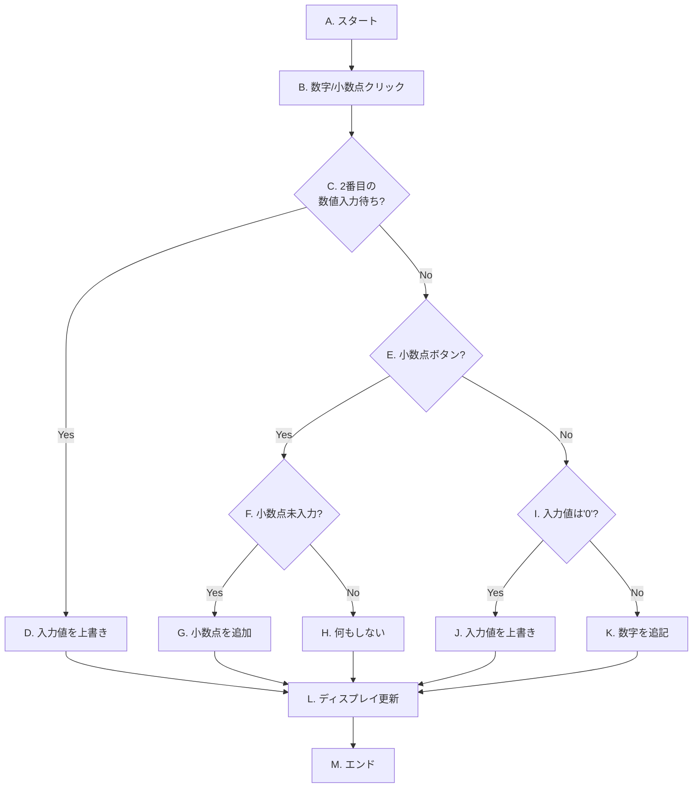
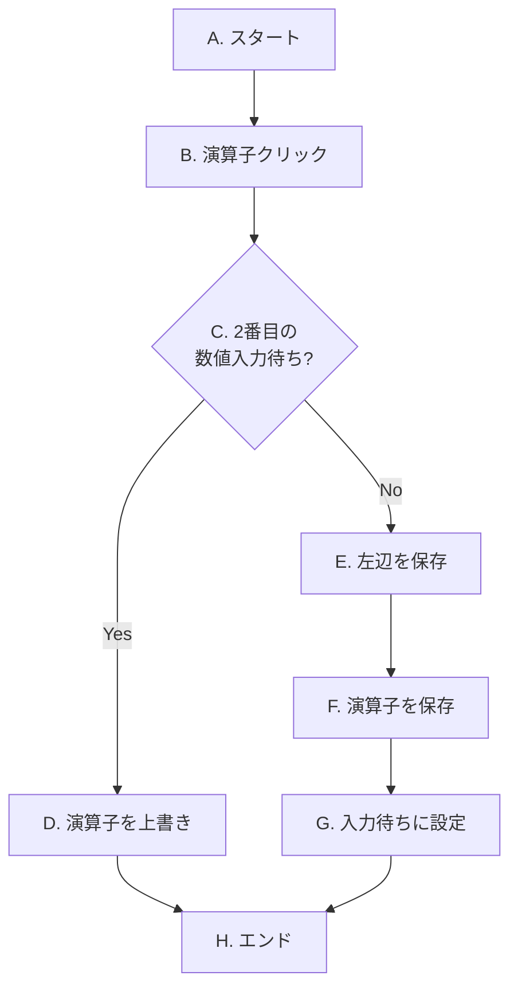
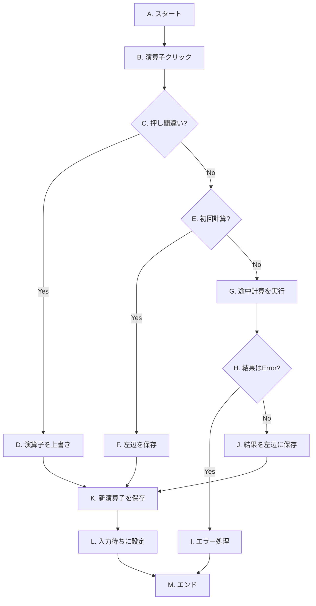

# OIC2025-Front03
動きを試す。
https://jun1waka.github.io/OIC2025-Front03/


電卓を作る
* 電卓のボタンを押すと表示窓に数値が表示される
* 四則演算を実行
* 「＝」ボタンで計算結果表示
* クリア・ACの動きを作る
# 電卓アプリケーション開発 課題仕様書・手順書
この資料は、専門学校の学生がJavaScriptを用いて電卓アプリケーションを作成するための仕様書および手順書です。各ステップは「課題」「考え方のヒント」「フローチャート」「解法」の順で構成されています。まずは課題を読んで自分なりの答えを考え、ヒントを参考にしながら実装に挑戦し、最後に解法で答え合わせをする、という流れで学習を進めてください。

## Step 1: 画面の表示 (HTML/CSS)
最初の目標は、電卓の見た目をHTMLとCSSで作成することです。
*(このステップの内容は前回と同様です)*

### 1.1. 課題
以下の仕様を満たす電卓のレイアウトを作成しなさい。
* **全体**: 電卓のすべての部品を囲む、一つの大きな箱(div)を用意する。
* **ディスプレイ**: 数字や計算結果が表示される画面部分を作成する。
* **ボタン**:0〜9の数字、小数点(.)、四則演算(+, -, *, /)、オールクリア(AC)、イコール(=)の各ボタンを配置する。CSSで見やすく、4列に並ぶようにレイアウトする。
* **準備**: 後のステップで実装する「ドラッグ移動機能」のために、電卓全体が画面上の好きな位置に配置できるよう、CSSで準備をしておく。

### 1.2. 考え方のヒント
* **HTMLの構成**: `<div>` タグで部品を意味のあるまとまりで囲み、`class`属性で名前をつけます。
* **CSSでのデザイン**: `display: flex` と `flex-wrap: wrap` でボタンを4列に並べ、`position: fixed` で移動の準備をします。

### 1.3. 解法（コード例）
**HTML (index.html)**
```html
<!DOCTYPE html>
<html>
<head>
    <meta charset="UTF-8">
    <link rel="stylesheet" href="css/style.css">
    <title>電卓のサンプル</title>
</head>
<body>
    <div class="calc_app">
        <div class="display"></div>
        <div class="box">
            <div class="reset">AC</div>
            <div class="switch_dummy"></div>
            <div class="switch_dummy"></div>
            <div class="calculation">/</div>
            <div class="switch">7</div>
            <div class="switch">8</div>
            <div class="switch">9</div>
            <div class="calculation">*</div>
            <div class="switch">4</div>
            <div class="switch">5</div>
            <div class="switch">6</div>
            <div class="calculation">-</div>
            <div class="switch">1</div>
            <div class="switch">2</div>
            <div class="switch">3</div>
            <div class="calculation">+</div>
            <div class="switch">0</div>
            <div class="switch">.</div>
            <div class="switch_dummy"></div>
            <div class="result">=</div>
        </div>
    </div>
    <script src="js/app.js"></script>
</body>
</html>
```

**CSS (style.css)**
```css
.calc_app {
	border: 1px solid #ccc;
	padding: 10px;
	position: fixed;
	text-align: center;
    background-color: #f0f0f0;
    border-radius: 8px;
    box-shadow: 0 4px 8px rgba(0,0,0,0.1);
}
.display {
	border: 1px solid #333;
	width: 200px;
	height: 50px;
	margin-bottom: 10px;
	line-height: 50px;
	text-align: right;
	overflow: hidden;
    padding: 0 10px;
    background-color: #e0e0e0;
    border-radius: 5px;
}
.box {
	width: 200px;
	display: flex;
	flex-wrap: wrap;
}
.switch, .switch_dummy, .reset, .result, .calculation {
	height: 50px;
	line-height: 50px;
	text-align: center;
	border: 1px solid #ccc;
	box-sizing: border-box;
	cursor: pointer;
    margin: 1px;
    width: calc(25% - 2px);
}
```

## Step 2: イベントの設定 (JavaScript)
見た目ができたら、次はボタンが押されたことをJavaScriptで検知できるようにします。
*(このステップの内容は前回と同様です)*

### 2.1. 解法（コード例）
`app.js` に以下のコードを記述します。
```javascript
// --- 1. HTML要素の取得 ---
const display = document.querySelector('.display');
const switches = document.querySelectorAll('.switch');
const calculations = document.querySelectorAll('.calculation');
const resets = document.querySelectorAll('.reset');
const results = document.querySelectorAll('.result');

// --- 2. イベントリスナーの設定（この時点ではコンソール出力のみ） ---
switches.forEach(button => button.addEventListener('click', e => console.log(e.target.textContent)));
calculations.forEach(button => button.addEventListener('click', e => console.log(e.target.textContent)));
resets.forEach(button => button.addEventListener('click', () => console.log('AC')));
results.forEach(button => button.addEventListener('click', () => console.log('=')));
```

## Step 3: 計算機能の実装（基本編）
いよいよ電卓の心臓部である計算ロジックを実装します。まずは `1 + 2 = 3` のような簡単な計算ができることを目指します。

### 3.1. 準備
#### 3.1.1. 状態管理用の変数を準備しよう
##### 課題
計算には「今入力している数値」や「前に押された演算子」など、様々な情報が必要です。これらの情報を一時的に保存しておくための「変数」を`app.js`の冒頭に準備してください。

##### 解法（コード例）
```javascript
// --- 3. 電卓の計算機能 ---
let currentInput = "0";
let operator = "";
let left = null;
let isWaitingForSecondOperand = false;
```

#### 3.1.2. 便利な関数を準備しよう
##### 課題
①ディスプレイの表示を更新する、②計算状態をすべてリセットする、という2つの便利な関数 `updateDisplay()` と `clearAll()` を作成してください。

##### 解法（コード例）
```javascript
function updateDisplay(value) {
    display.textContent = value;
}

function clearAll() {
    currentInput = "0";
    operator = "";
    left = null;
    isWaitingForSecondOperand = false;
    updateDisplay("0");
}

// ACボタンのイベントリスナーもここで設定
resets.forEach(button => button.addEventListener('click', clearAll));

// 初期表示
updateDisplay(currentInput);
```

### 3.2. 入力処理
#### 3.2.1. 数字・小数点ボタンの処理
##### 課題
数字ボタン（0-9）と小数点ボタン(.)が押されたときに、ディスプレイの表示が正しく更新されるように実装してください。

##### 処理のフローチャート

* **[C] 2番目の数値入力待ち?**: `isWaitingForSecondOperand` が `true` かどうかを判定します。
* **[D] 入力値を上書き**: **[C]** がYesの場合、`currentInput` を新しい数値で上書きし、`isWaitingForSecondOperand` を `false` に戻します。
* **[F] 小数点未入力?**: **[E]** がYesの場合、`currentInput` に `.` が含まれていないかを確認します。
* **[I] 入力値は'0'?**: **[E]** がNoの場合、`currentInput` が `"0"` の時に、`0` 以外の数字が押されたかを判定します。

##### 解法（コード例）
```javascript
switches.forEach(function (button) {
    button.addEventListener('click', function (e) {
        const value = e.target.textContent;

        if (isWaitingForSecondOperand) {
            currentInput = value;
            isWaitingForSecondOperand = false;
        } else {
            if (currentInput === "0" && value !== ".") {
                currentInput = value;
            } else if (value === "." && !currentInput.includes(".")) {
                currentInput += value;
            } else if (value !== ".") {
                currentInput += value;
            }
        }
        updateDisplay(currentInput);
    });
});
```

### 3.3. 簡単な計算 (A + B = C) の実装
#### 3.3.1. 演算子ボタンの処理（状態保存と押し間違い対応）
##### 課題
`123 +` のように初めて演算子が押されたときの処理と、`5 *` の直後に間違えて `+` を押すような「押し間違い」に対応する処理を実装してください。

##### 処理のフローチャート

* **[C] 2番目の数値入力待ち?**: `isWaitingForSecondOperand` が `true` か（押し間違いか）を判定します。
* **[D] 演算子を上書き**: **[C]** がYesの場合、計算はせず `operator` を新しい演算子で上書きするだけにします。
* **[E, F, G]**: **[C]** がNoの場合、`currentInput` を `left` に保存し、押された演算子を `operator` に保存。`isWaitingForSecondOperand` を `true` にします。

##### 解法（コード例）
```javascript
calculations.forEach(function (button) {
    button.addEventListener('click', function (e) {
        const newOperator = e.target.textContent;

        if (isWaitingForSecondOperand) {
            operator = newOperator;
            return;
        }

        left = parseFloat(currentInput);
        operator = newOperator;
        isWaitingForSecondOperand = true;
    });
});
```

#### 3.3.2. 計算実行関数 `calculate` の作成
##### 課題
2つの数値と演算子を受け取って、計算結果を返す `calculate()` 関数を作成してください。0で割った場合のエラー処理も実装します。

##### 解法（コード例）
```javascript
function calculate(n1, op, n2) {
    let result = 0;
    switch (op) {
        case '+': result = n1 + n2; break;
        case '-': result = n1 - n2; break;
        case '*': result = n1 * n2; break;
        case '/':
            if (n2 === 0) return "Error";
            result = n1 / n2;
            break;
        default: return n2;
    }
    return Math.round(result * 10000000000) / 10000000000;
}
```

#### 3.3.3. `=` ボタンの処理
##### 課題
`=`ボタンが押されたら、`calculate()`関数を使って計算を実行し、結果を表示する処理を実装してください。

##### 解法（コード例）
```javascript
results.forEach(function (button) {
    button.addEventListener('click', function () {
        if (left === null || operator === "" || isWaitingForSecondOperand) return;
        
        const right = parseFloat(currentInput);
        const result = calculate(left, operator, right);
        
        if (result === "Error") {
            clearAll();
            updateDisplay("Error");
            return;
        }
        
        updateDisplay(result);
        
        // 計算後の状態を更新
        currentInput = result.toString();
        left = result;
        operator = "";
        isWaitingForSecondOperand = true;
    });
});
```

## Step 4: 計算機能の実装（発展編）
基本機能が完成したら、次は `1 + 2 + 3 =` のような連続計算に対応できるように機能を拡張します。

### 4.1. 連続計算 (A + B + C ...) への対応
##### 課題
`1 + 2 +` と押された時点で `3` を計算・表示できるように、Step 3.3.1 で作成した演算子ボタンの処理をさらに改良してください。

##### 処理のフローチャート

* **[C] 押し間違い?**: `isWaitingForSecondOperand` が `true` かを判定します。
* **[E] 初回計算?**: `left` が `null` かどうかで、最初の計算か連続計算かを判断します。
* **[G] 途中計算を実行**: **[E]** がNoの場合（連続計算）、ここまでの計算を実行します。
* **[J] 結果を左辺に保存**: 計算結果をディスプレイに表示し、次の計算のために `left` を更新します。

##### 解法（コード例）
*Step 3.3.1の`calculations`の処理を、以下のように完全に書き換えます。*
```javascript
calculations.forEach(function (button) {
    button.addEventListener('click', function (e) {
        const newOperator = e.target.textContent;

        if (isWaitingForSecondOperand) {
            operator = newOperator;
            return;
        }

        if (left === null) {
            left = parseFloat(currentInput);
        } else {
            const right = parseFloat(currentInput);
            const result = calculate(left, operator, right);

            if (result === "Error") {
                clearAll();
                updateDisplay("Error");
                return;
            }
            
            updateDisplay(result);
            left = result;
        }

        operator = newOperator;
        isWaitingForSecondOperand = true;
    });
});
```

## Step 5: 画面移動機能の実装
最後に、電卓をドラッグ＆ドロップで移動できる機能を追加します。

### 5.1. 解法（コード例）
```javascript
// --- 画面移動機能 ---
let isClick = false;
let clickX, clickY;
let clickPosition;
const calcApp = document.querySelector('.calc_app');

calcApp.addEventListener('mousedown', function (e) {
    isClick = true;
    clickX = e.screenX;
    clickY = e.screenY;
    clickPosition = calcApp.getBoundingClientRect();
});

calcApp.addEventListener('mouseup', function () {
    isClick = false;
});

calcApp.addEventListener('mouseout', function () {
    isClick = false;
});

calcApp.addEventListener('mousemove', function (e) {
    if (!isClick) return;
    
    const newTop = clickPosition.top + (e.screenY - clickY);
    const newLeft = clickPosition.left + (e.screenX - clickX);
    calcApp.style.top = newTop + 'px';
    calcApp.style.left = newLeft + 'px';
});
```
